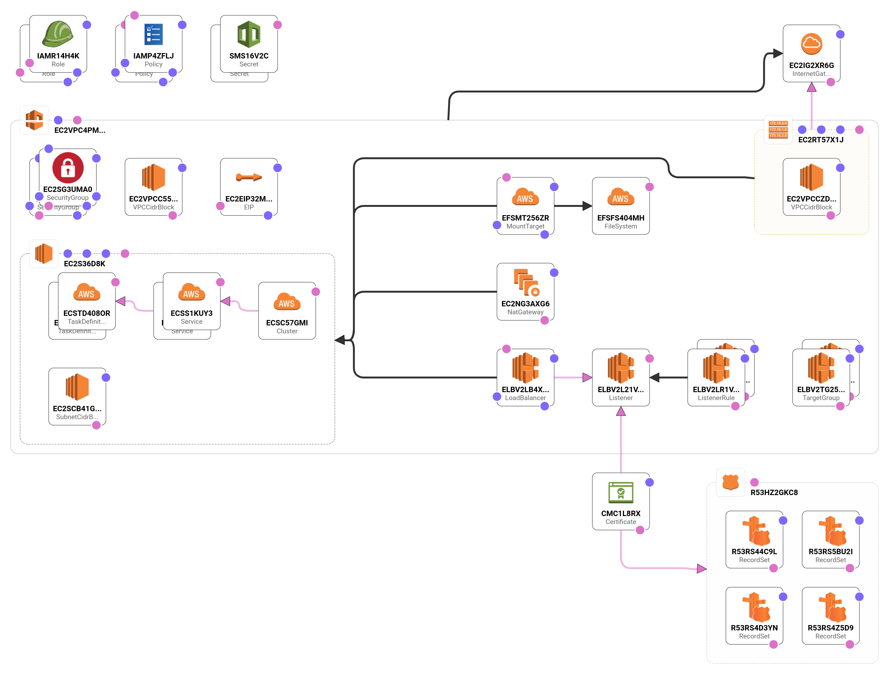
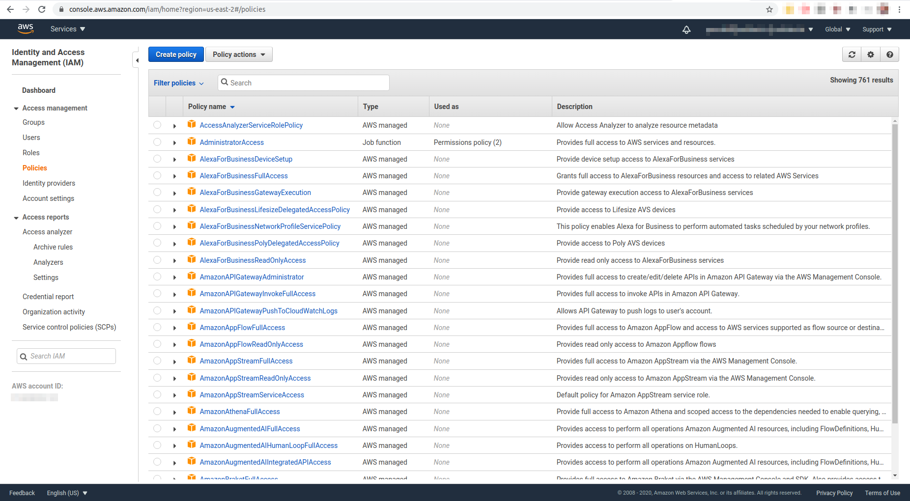
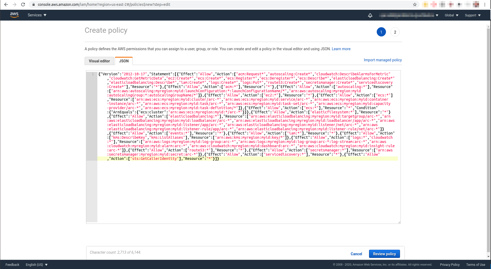
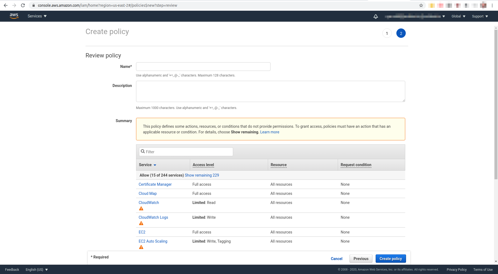

# Configuring AWS platforms

## Architect IAM policy

Architect deployments to the AWS ECS platform type will create a variety of services on your behalf in the availability zone provided when the platform was first created. In order to create these resources, your platform needs to be registered with an AWS account that has access to them. Here you'll learn what resources Architect may seek to provision on your behalf so that you can create an IAM policy that allows Architect to create them.

### Required AWS services

* Load Balancer
* Security Group
* Task Definition
* Security Group
* ECS Service
* Secret Manager Secret / Secret Manager Secrete Version
* VPC
* Internet Gateway
* Subnet
* Elastic IP
* NAT Gateway
* IAM Role
* IAM Policy
* AMI
* Launch Configuration
* Autoscaling Group
* Security Group
* ECS Cluster
* Elastic File System
* Route 53 Record
* CloudWatch Event Rule
* CloudWatch Event Target

A generalized architecture for an ECS deployment can be seen below. Amounts of resources vary, such as ECS Cluster Services, depending on the component(s) being deployed to the platform.

### The policy template

The easiest way to generate an IAM policy

An example policy can be found [here](https://api.architect.io/accounts/3ed6f3a7-28cf-49b6-88dd-0a54d319045d/aws-iam-policy?region=my_region&aws_account_id=my_account_id), where you simply need to replace `my_region` with your desired AWS region and `my_account_id` with your AWS account ID.

### Register the policy with AWS

<strong>1. Navigate to the IAM Dashboard</strong>

To add the IAM policy to your account, log in to the AWS console and navigate to the IAM dashboard at `https://console.aws.amazon.com/iam/home?region=your_target_region#/home`. `your_target_region` should be the same region that you plan to use to register your ECS platform with Architect (ex. us-east-2).

<strong>2. Create a policy</strong>

Select the blue "Create policy" button at the top of the page to create the required policy.

<strong>3. Select the JSON editor</strong>

On the "Create policy" page, select the JSON editor by clicking the "JSON" tab. This is where the previously-generated policy will be used. Be sure that you have replaced the defaults `my_region` and `my_account_id` with real values. Clear any existing default JSON, then paste the policy into the JSON editor. Select the blue "Review policy" button at the bottom of the page to review the policy that will be created.

<strong>4. Finish policy creation</strong>

On the "Review policy" page, add a policy name then select "Create policy" at the bottom right. You should have been taken back to the policy list page and there should be a message indicating successful policy creation at the top. You can now take this policy and add it to your IAM user.

